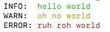
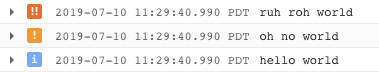

# snackdriver

A bite-sized bunyan logger with color and a built-in stackdriver stream.

### Example:

```javascript
const Logger = require("./log")({
	logName: "log-name", // used
	version: "1.3.10",
	level: "info"
});

async () => {
	const { log, log_mw } = await Logger;
	app.use(log_mw);

	// info
	log.info("hello world");
	log.warn("oh no world");
	log.error("ruh roh world");

	// middleware usage
	app.use((req, res, next) => {
		req.log.info("huzzah!");

		next();
	});
};
```

**Console output:**  


And if your `NODE_ENV` is set to `production` it logs to stack driver.

**Stackdriver output:**  

